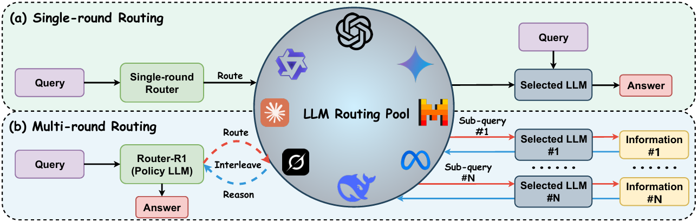

# Router-R1


Official implementation of Router-R1: Teaching LLMs Multi-Round Routing and Aggregation via Reinforcement Learning


<p align="center">
    <a href="https://ulab-uiuc.github.io/Router-R1">
        
    </a>
    <a href="https://arxiv.org/abs/x">
        
    </a>
    <!-- <a href="xxx">
        
    </a> -->
    <a href="https://github.com/ulab-uiuc/Router-R1/blob/master/LICENSE">
        
    </a>
    <br>
    <a href="https://github.com/ulab-uiuc/Router-R1">
        
    </a>
    <a href="https://github.com/ulab-uiuc/Router-R1">
        
    </a>
    <a href="https://github.com/ulab-uiuc/Router-R1">
        
    </a>
</p>


<p align="center">
    <a href="https://ulab-uiuc.github.io/Router-R1/">🌐 Project Page</a> |
    <a href="https://arxiv.org/abs/xxxx.xxxxx">📜 arXiv</a>
    <!-- <a href="xxx">📮 Twitter Post</a> -->
<p>


<div align="center">
  
</div>


## News

**[2025.06.0x]** 🌟 Router-R1 is released.


## 📌Environment Setup

```bash
conda create -n router-r1 python=3.9
conda activate router-r1
pip install torch==2.4.0 --index-url https://download.pytorch.org/whl/cu121
pip3 install vllm==0.6.3 # or you can install 0.5.4, 0.4.2 and 0.3.1

# verl
pip install -e .

# flash attention 2
pip3 install flash-attn --no-build-isolation
pip install wandb
```


## 📊Experiments


**(1) Data Preparation**

The following scripts generate mixed training and testing datasets for Router-R1 by sampling from multiple QA datasets. By default, 7K examples are randomly selected from each of NQ and HotpotQA.

```bash
# DATASET Choices: nq, triviaqa, popqa, hotpotqa, 2wikimultihopqa, musique, bamboogle
# MODEL Choices: qwen, llama

# Generate training set (default: 7K from nq + 7K from hotpotqa)
python data_process/qa_train_merge.py --data_sources nq,hotpotqa --model qwen

# Generate validation set
python data_process/qa_test_merge.py --data_sources nq,hotpotqa --model qwen

# Generate test set
python data_process/qa_test_gen.py --data_sources nq --model qwen
```

**(2) Training**

Start training Router-R1 with the following command:

```bash
bash train.sh
```

> 

> \[!IMPORTANT\]
>
> Make sure to set your own API KEY in the train.sh script before running.


**(3) Evaluation**

You can evaluate Router-R1 on the previously generated test set with:

```bash
bash test.sh
```

Make sure the test data has been generated beforehand using qa_test_gen.py.


## Acknowledge

We sincerely acknowledge the contributions of [Deepseek-R1](https://github.com/deepseek-ai/DeepSeek-R1) and [Search-R1](https://github.com/PeterGriffinJin/Search-R1), whose work has been a valuable source of inspiration. This project builds upon the foundations laid by [veRL](https://github.com/volcengine/verl), and we are deeply grateful for the open-source efforts and advancements made by these communities. 


## Citation

```bibtex
@article{Router-R1,
  title={Router-R1: Teaching LLMs Multi-Round Routing and Aggregation via Reinforcement Learning},
  author={Haozhen Zhang and Tao Feng and Jiaxuan You},
  journal={arXiv preprint arXiv:xxxx.xxxxx},
  year={2025}
}
```
